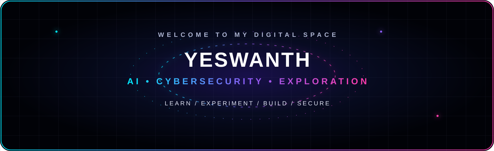

# Hi, I'm Yeswanth Krishna Chowdary 👋

  

## 👨‍💻 About Me

- 🎓 B.Tech Information Technology student
- 🤖 Interested in **Artificial Intelligence and Cybersecurity**
- 💻 Building my foundation in software development and secure computing
- 🌱 Continuously learning, experimenting, and improving
- 🧠 Interested in using AI to solve practical technical problems

## 🛠️ Current Skills

  

**Languages:** Python · Java · SQL

**Tools:** Git · GitHub · VS Code

## 📚 Currently Learning

  

- 🐧 Linux fundamentals
- 🌐 Networking & cybersecurity fundamentals
- 🤖 Machine learning fundamentals
- 🔐 AI applied to cybersecurity
- 🧩 Problem solving and software development

## 📊 GitHub Statistics

  
  

## 🔥 Contribution Streak

  

## 📈 Contribution Activity

  

## 🐍 Contribution Snake

<picture>
  <source media="(prefers-color-scheme: dark)" srcset="https://raw.githubusercontent.com/yeswanth08-web/yeswanth08-web/output/github-contribution-grid-snake-dark.svg" />
  <source media="(prefers-color-scheme: light)" srcset="https://raw.githubusercontent.com/yeswanth08-web/yeswanth08-web/output/github-contribution-grid-snake.svg" />
  
</picture>

## 🎯 What I'm Working Toward

Building strong foundations in **AI, cybersecurity, programming, and problem solving** through consistent learning and hands-on practice.

---

  <b>Learn • Build • Secure • Improve</b>

